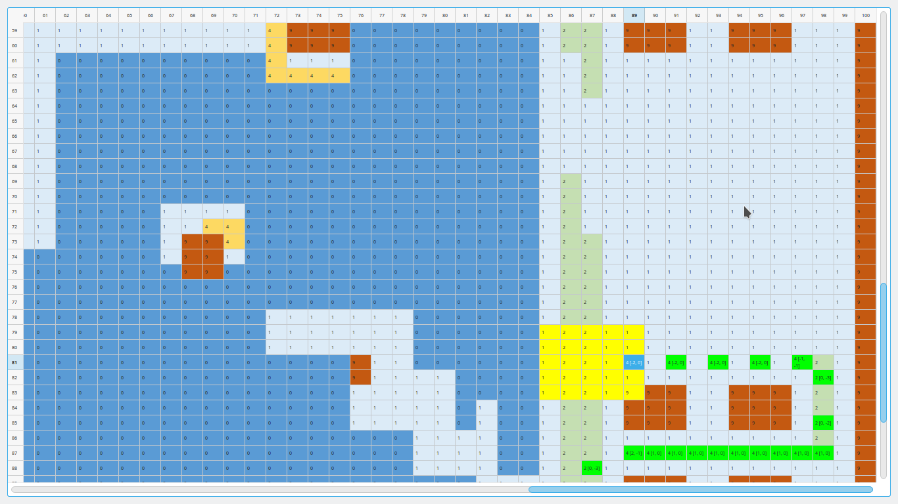

# Интерактивный визуализатор карты

Задание было [здесь](https://cups.online/ru/tasks/1205), ниже продублирован его текст.

## Запуск и управление

Введите `python solve.scroll.py`, чтобы запустить программу. Карта будет автоматически сгенерирована из файла `table.csv`.

Левый клик мыши на любую ячейку перемещает на неё сани. В тексте ячейки будет зафиксирован вектор, по которому вы на неё пришли. Жёлтым цветом будут выделены ячейки, на которые возможен следующий ход.

Правый клик отменяет последний ход (только один).

Чтобы провести дорожные работы, выделите нужную ячейку нажатием средней кнопки мыши (колёсика), затем нажмите любую кнопку клавиатуры.

### Ввод и вывод

При каждом перемещении саней текущий `path` дописывается в файл `paths.txt`, `job` — в `jobs.txt`.

Доступно сохранение и загрузка решения с отображением на карте, для этого программу нужно запустить, передав дополнительно любой аргумент. Например: `python solve.scroll.py aaa`. `path` и `job` считываются из файла `sample_submission.json`.

### Интерфейс



## Задания

### Условия

#### Карта

Суть игры - построение маршрута перемещения саней Деда Мороза по карте (игровому полю) по правилам "гонок на бумаге". Игровое поле 2-мерно. Состоит из "клеток" (а точнее - "точек"), по сути это - целочисленная матрица (модель клеточного листа бумаги). Каждая клетка может быть одного из следующих типов:

дорога: клетка, перемещение по которой происходит по стандартным правилам (см. ниже).

снег: перемещение по таким клеткам возможно, но с меньшими по сравнению с дорогой скоростью и маневренностью.

лед: перемещение возможно, но без возможности управления вектором скорости, то есть с каким вектором был осуществлен заезд на лед, с таким же будут выполнены все следующие шаги до тех пор, пока машина не окажется на другом типе поверхности.

препятствие: перемещение по таким клеткам невозможно. При попадании саней на такую клетку попытка завершается сходом с дистанции.
стартовая позиция: клетка, из которой стартуют сани.

цель: клетки, которые необходимо посетить, чтобы раздать подарки. Чем больше таких клеток посетят сани, тем больше очков в итоге заработает участник.

Формат карты (см. файл `table.csv`):

```
# surfaces
WALL = 9
ICE = 0
SNOW = 1
ROAD = 2
START = 3
DROP = 4

NAMES = {
  WALL: "СТЕНА",
  ICE: "ЛЕД",
  SNOW: "СНЕГ",
  ROAD: "ДОРОГА",
  START: "СТАРТ",
  DROP: "ЦЕЛЬ" }

RADIUS = {WALL: -1, ICE: 0, SNOW: 1, ROAD: 2, DROP: 2, START: 2}
```

#### Сани Деда Мороза

Сани управляются игроком путем выбора на каждом шаге одного из возможных векторов скорости. Набор возможных векторов шага n+1 зависит от вектора шага n . Конец вектора скорости всегда указывает точно на одну из клеток карты (то есть координаты вектора всегда целочисленные).

На трех иллюстрациях приведены примеры шагов (для поверхности "Снег". О влиянии разных типов поверхности - см. ниже). Красным цветом показана текущая позиция, зеленым - допустимые варианты движения, черная стрелка - текущий вектор скорости (уже выполненный), пунктирная стрелка - будущий вектор скорости "по умолчанию" (копия последнего вектора, проложенная из текущей позиции).

Для нормальной поверхности (дороги) набор векторов может указывать на 1 из 25 клеток, центральная из которых определяется вектором, точно повторяющим текущую скорость. Таким образом машина шаг за шагом может осуществлять разгон, торможение, повороты, либо продолжать движение с постоянной скоростью и направлением.

На снегу изменение вектора скорости возможно только на +- 1 клетку игрового поля относительно центральной точки (итого 9 возможных векторов). А на льду сани становятся неуправляемыми - их несет ровно в ту же сторону и с такой же скоростью, с которой был осуществлен въезд на лед.

#### Дорожные работы
Деду Морозу можно помочь не только планированием маршрута, но и улучшением качества трассы (расчисткой снега или обработкой льда химикатами). Для этого нужно составить список клеток игрового поля, которые должны быть улучшены. Доступны следующие улучшения:

```
Лед -> Снег
Снег -> Дорога
```

Для остальных типов клеток команды улучшения будут проигнорированы.
Каждое улучшение тратит одну единицу игрового времени (столько же, сколько один шаг саней по маршруту). Максимальное число улучшений 3600.

#### Формат файла решения
Задача участника - составить оптимальный маршрут, позволяющий развезти как можно больше подарков за отведенное время. В файле решения (формат JSON) должно быть два массива:

```
job: [[x, y], [x, y], ... ] - список пар абсолютных координат клеток поля, которые требуется улучшить перед стартом
path: [[dx, dy], [dx, dy], ... ] - упорядоченный список "ходов" саней Деда Мороза. Ходы задаются парами относительных координат
```

#### Пример файла решения:

```json
{
    "job": [[0, 1], [5, 7]],
    "path": [[0, 1], [0, 2], [-1, 1], [-1, 0], [-1, 0], [0, -1], [0, -2], [1, -2], [0, -1]]
}
```


#### Расчет очков
Очки вычисляются по формуле: `Score = 3600 * 1.1 p / (t + j)`, где:

p - количество успешно доставленных подарков (p > 0)
t - время (количество шагов), затраченное на выполнение задания (20 <= t <= 3600)
j - количество улучшенных клеток карты (0 <= j;  t + j <= 3600)

В случае столкновения со стеной, выезда за края карты или попытки выполнения недопустимого правилами хода - начисляется 0 очков.

Максимальное время игры равно 3600 шагов. Файл решения не должен превышать 16 Мб.

## Ссылки

Работа коллег вдохновляет:

- [демонстрация аналогичного визуализатора](https://www.youtube.com/watch?v=yJGbRCxt2hM)
- [алгоритмическое решение задачи](https://habr.com/ru/post/600003/)